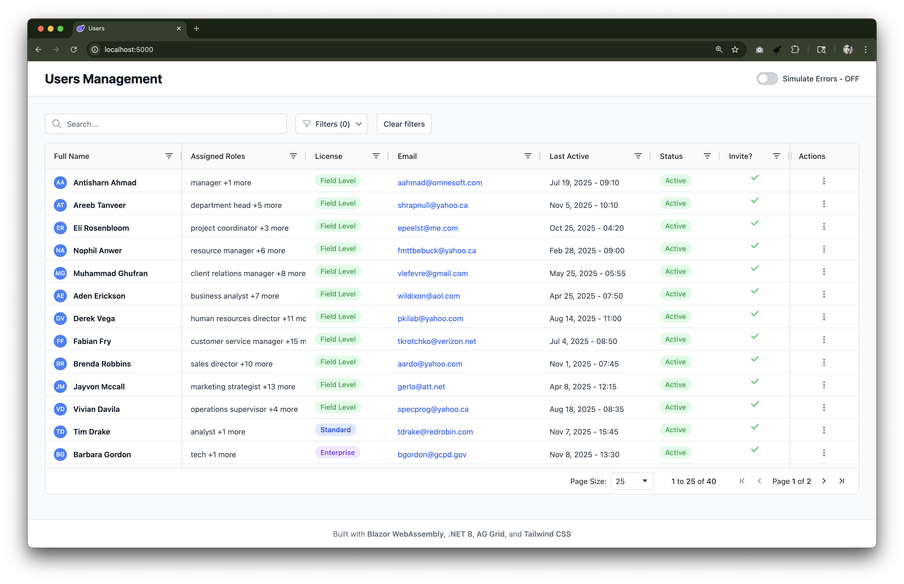

# OmneSoft

A modern Blazor WebAssembly application demonstrating professional user management with AG Grid integration and reactive state management.

## Features

- **Professional Data Grid**: AG Grid Community Edition v33.3.2 with sorting, filtering, pagination, and global search
- **Error Simulation**: 5 error scenarios for testing (network, timeout, JSON, 404, server errors)
- **Reactive State Management**: AppStateService with intelligent loading coordination
- **Modern UI**: Tailwind CSS with responsive design and accessibility compliance
- **Code Quality**: ESLint, Prettier, and Husky pre-commit hooks

## Tech Stack

- **Frontend**: Blazor WebAssembly (.NET 8.0.8 LTS)
- **Styling**: Tailwind CSS v3.4.17 with PostCSS processing
- **Data Grid**: AG Grid Community Edition v33.3.2 (CDN-hosted)
- **Code Quality**: ESLint v9.33.0, Prettier v3.6.2, Husky v9.1.7
- **Build**: npm scripts with automated CSS compilation

## Getting Started

### Prerequisites

- .NET 8 SDK (8.0.8 or later)
- Node.js (v16 or later) with npm
- Modern web browser with WebAssembly support

### Quick Start

```bash
git clone <repository-url>
cd OmneSoft
npm install
dotnet run
```

Open your browser to `https://localhost:5001` or `http://localhost:5000`

### Available Commands

- `npm run dev` - Build CSS and start development server
- `npm run build` - Build CSS and compile .NET project
- `npm run publish` - Build CSS and publish for production
- `npm run lint` - Run ESLint code analysis
- `npm run format` - Format code with Prettier

## Architecture

- **State Management**: Custom `AppStateService` with reactive coordination and proper disposal patterns
- **AG Grid Integration**: Fixed height strategy with Community Edition optimizations
- **Error Handling**: 5 error simulation types with automatic grid state reset

## Project Structure

```
OmneSoft/
├── Components/UI/           # Reusable UI components
│   └── UsersGrid.razor     # Advanced data grid component with AG Grid v33.3.2
├── Pages/
│   └── Home.razor         # Main users management page
├── Services/
│   ├── IAppStateService.cs # State management interface
│   └── AppStateService.cs  # Reactive state implementation
├── Models/
│   └── AppSettings.cs     # Application configuration models
├── wwwroot/
│   ├── css/
│   │   ├── app.css        # Source Tailwind CSS with AG Grid optimizations
│   │   └── app.min.css    # Compiled and minified CSS (auto-generated)
│   ├── js/
│   │   └── users-interop.js # AG Grid JavaScript interop with v33.3.2 compatibility
│   ├── data/users.json    # Sample user data (40 superhero-themed records)
│   ├── index.html         # Main HTML template with CDN references
│   └── appsettings.json   # Client-side configuration
├── App.razor              # Root application component with routing
├── MainLayout.razor       # Application layout
├── Program.cs             # Entry point and DI configuration
└── _Imports.razor         # Global using statements
```

## Key Features

### Data Grid Capabilities

- **Advanced Filtering**: Global search, column filters, and custom status filtering
- **Pagination**: 10/25/50 rows per page with navigation controls
- **Professional Layout**: 8-column layout with strategic pinning and responsive design
- **Error Testing**: Built-in error simulation with 5 different scenarios
- **Accessibility**: WCAG compliance with ARIA attributes and keyboard navigation

### Error Simulation

Toggle "Simulate Errors" to test 5 scenarios:

1. Network connection errors
2. Request timeouts
3. JSON parsing errors
4. File not found (404)
5. Unexpected server errors

## Usage

The Users Management interface provides:

- Advanced sorting, filtering, and pagination
- Global search with debounced input
- Custom status filtering with dropdown selection
- Error simulation toggle for testing scenarios
- Contextual refresh button during error states

## License

This project is licensed under the MIT License - see the [LICENSE](LICENSE) file for details.

## Development

### Architecture

- **Component-Based**: Reusable UI components with proper disposal patterns
- **State Management**: Centralized `AppStateService` with reactive subscriptions
- **JavaScript Interop**: Dedicated layer for AG Grid integration
- **Memory Management**: Comprehensive disposal patterns and cleanup

### Build Process

1. **CSS Processing**: Tailwind CSS compiled with PostCSS
2. **Production Optimization**: CSS minification with cssnano
3. **Automated Builds**: CSS builds automatically before .NET compilation
4. **Code Quality**: Pre-commit hooks ensure consistent formatting

### Deployment

```bash
npm run publish
```

Output: `bin/Release/net8.0/publish/wwwroot/` - ready for any static hosting serviceion, integrated controls, and calculated viewport heights for maximum grid presentation efficiency.

### Available Scripts

- `npm run dev` - Build CSS and start development server
- `npm run start` - Build CSS and start the application
- `npm run build` - Build CSS and compile .NET application
- `npm run publish` - Build CSS and publish the application
- `npm run lint` - Run ESLint on JavaScript files
- `npm run lint:fix` - Fix ESLint issues automatically
- `npm run format` - Format code with Prettier
- `npm run format:check` - Check code formatting with Prettier
- `npm run build-css` - Build CSS in watch mode for development
- `npm run build-css-prod` - Build and minify CSS for production
- `npm run prepare` - Set up Husky git hooks

### Component Architecture

The application features a modular component architecture:

#### UI Components

- **UsersGrid.razor**: Specialized user management grid with comprehensive error handling, loading states, and AG Grid integration
- **Button.razor**: Custom button component with variants (Primary, Secondary, Success, Danger) and loading states

#### Layout Components

- **MainLayout.razor**: Responsive main layout with conditional rendering for full viewport pages
- **App.razor**: Root application component with routing configuration

#### Services

- **AppStateService**: Centralized state management with reactive patterns and event-driven updates
- **IAppStateService**: Service interface for dependency injection and testability

## Application Overview

### Main User Management Interface (Home Page)

The application's primary interface (`/`) provides a professional, optimized user management system featuring:

#### Core Functionality

- **Professional Data Grid**: Interactive AG Grid displaying 40 superhero-themed user records with sorting, filtering, and selection capabilities within an optimized flexible layout
- **Streamlined User Experience**: Professional interface with dedicated header and flexible content area that adapts to viewport size
- **User Selection Management**: Single-row selection with real-time row click and selection event handling
- **Simple Error Simulation Testing**: Toggle-able error simulation that demonstrates 404 "File Not Found" errors, integrated into the header for easy development testing of error handling

#### User Interface Features

- **Flexible Layout**: Streamlined layout with branded header and flexible content area using `flex-1` for maximum grid visibility
- **Branded Header**: "Users Management" title with contextual refresh functionality (appears only during error simulation) and error simulation toggle
- **Adaptive Content Area**: Main section with proper padding (p-8) and full height grid container (`h-full`) for optimal data grid presentation
- **Technology Footer**: Footer displaying the technology stack (Blazor WebAssembly, .NET 8, AG Grid, Tailwind CSS)
- **Modern Styling**: Tailwind CSS classes for shadows, borders, background colors, and responsive design
- **Integrated Controls**: Error simulation toggle and refresh controls built directly into the header for streamlined access
- **Comprehensive Error Handling**: All error states, loading indicators, and retry mechanisms are built directly into the grid component

#### Data Management

- **Automatic Data Loading**: Users data automatically loads from `data/users.json` on page initialization
- **Comprehensive Error Handling**: Handles network failures, timeouts, HTTP errors (404, 401, 500), and JSON parsing errors
- **Built-in Retry Mechanisms**: Error states include retry functionality with loading state management
- **Loading State Management**: Dual loading state approach (component-specific and global coordination)
- **Enhanced Manual Refresh**: Contextual header-integrated refresh button (visible during error simulation) with grid state reset for clean re-initialization and loading state feedback

#### User Experience Enhancements

- **Adaptive Grid Display**: Flexible layout system ensures maximum data visibility that adapts to different viewport sizes
- **Integrated Controls**: Error simulation and refresh functionality built directly into the header for streamlined access
- **Professional Presentation**: Clean, modern interface optimized for data management tasks
- **Responsive Design**: Layout automatically adjusts to provide optimal user experience across different screen sizesntrols\*\*: All essential controls are built into the header for streamlined user experience
- **Visual Consistency**: Consistent use of Tailwind CSS classes for shadows (shadow-sm), borders (border-b, border-t), and spacing
- **Accessibility**: Proper focus management, ARIA attributes, and keyboard navigation support
- **Responsive Design**: Grid and layout automatically adapt to viewport size changes with optimized height calculations
- **State Persistence**: Integration with AppStateService for global state coordination

## AG Grid + Blazor Integration

### JavaScript Interop Approach

This application uses **IJSRuntime with Custom JavaScript Functions** for AG Grid integration.

#### Chosen Approach: Custom JavaScript Functions

**Implementation:**

- Custom `window.usersInterop` namespace in `users-interop.js`
- C# calls JavaScript via `IJSRuntime.InvokeVoidAsync()` and `IJSRuntime.InvokeAsync<T>()`
- JavaScript calls C# via `DotNetObjectReference` and `[JSInvokable]` methods

**Why This Approach:**

- Full control over AG Grid lifecycle and features
- Direct JavaScript calls without abstraction layers
- Clear separation between C# and JavaScript concerns
- Proven pattern for complex library integrations

#### Usage Pattern

```csharp
// C# Component
@inject IJSRuntime JSRuntime
private DotNetObjectReference<MyComponent>? dotNetRef;

protected override async Task OnAfterRenderAsync(bool firstRender)
{
    if (firstRender)
    {
        dotNetRef = DotNetObjectReference.Create(this);
        await JSRuntime.InvokeVoidAsync("usersInterop.createGrid", containerId, options, dotNetRef);
    }
}

[JSInvokable]
public void HandleGridEvent(object data) { /* Handle callback */ }

public async ValueTask DisposeAsync()
{
    await JSRuntime.InvokeVoidAsync("usersInterop.destroyGrid", containerId);
    dotNetRef?.Dispose();
}
```

```javascript
// JavaScript (users-interop.js)
window.usersInterop = {
  createGrid: function (containerId, options, dotNetRef) {
    // Initialize AG Grid
    // Set up event handlers that call dotNetRef.invokeMethodAsync()
  },
};
```

### Integration Architecture

#### 1. **JavaScript Interop Layer** (`wwwroot/js/users-interop.js`)

- Creates a bridge between Blazor C# and AG Grid JavaScript
- Manages grid instances in a Map for multiple grids
- Handles grid lifecycle: create, update, destroy
- Provides callbacks for row clicks and selection changes
- Uses the stable AG Grid v33.3.2 API (`agGrid.createGrid()`)
- Namespace: `window.usersInterop`

#### 2. **Blazor Component** (`Components/UI/UsersGrid.razor`)

- Wraps the JavaScript interop in a specialized user management component
- Provides strongly-typed parameters for configuration
- Handles component lifecycle and cleanup
- Supports event callbacks for row interactions
- Uses `DotNetObjectReference` for JavaScript-to-C# callbacks
- Can work with either interop layer depending on configuration

#### 3. **Dependencies** (`wwwroot/index.html`)

- AG Grid Community v33.3.2 from CDN
- Built-in Quartz theme via JavaScript configuration
- Multiple custom interop JavaScript files

### How to Use AG Grid Integration

#### UsersGrid Component (Primary User Management Interface)

The `UsersGrid` component is the core of the application's user management functionality. It's a production-ready grid specifically designed for user management with built-in error handling, loading states, data fetching, **centralized state management integration via AppStateService**, and **accessibility compliance**.

**Main Application Usage (Home Page - Professional Interface):**

```razor
@page "/"
@inject IJSRuntime JSRuntime
@inject IAppStateService AppState

<PageTitle>Users</PageTitle>

<header class="bg-white shadow-sm border-b">
    <div class="px-8 py-4">
        <div class="flex items-center justify-between">
            <h1 class="text-2xl font-bold text-gray-900">Users Management</h1>
            <div class="flex items-center space-x-4">
                @if (simulateErrors)
                {
                    <button @onclick="RefreshData"
                            disabled="@isRefreshing"
                            class="@GetRefreshButtonClass() font-medium py-2 px-4 rounded-lg transition-colors">
                        <!-- Contextual refresh button with loading state -->
                    </button>
                }

                <div class="flex items-center space-x-2">
                    <label class="flex items-center cursor-pointer">
                        <input type="checkbox" @bind="simulateErrors" class="sr-only">
                        <!-- Error simulation toggle -->
                    </label>
                </div>
            </div>
        </div>
    </div>
</header>

<div class="p-8" style="height: calc(100vh - 160px);">
    <UsersGrid @ref="usersGrid"
               ContainerId="users-grid"
               Height="100%"
               Width="100%"
               EnableSelection="true"
               SelectionMode="single"
               OnRowClicked="OnRowClicked"
               OnSelectionChanged="OnSelectionChanged"
               DataUrl="data/users.json"
               SimulateErrors="@simulateErrors" />
</div>

@code {
    private UsersGrid? usersGrid;
    private bool simulateErrors = true;
    private bool isRefreshing = false;

    private async Task RefreshData()
    {
        isRefreshing = true;
        if (usersGrid != null)
        {
            await usersGrid.RefreshData();
        }
        isRefreshing = false;
    }

    private void OnRowClicked(object rowData)
    {
        // Handle row click event
    }

    private void OnSelectionChanged(object[] selectedRows)
    {
        // Handle selection change
    }
}
```

**Custom Implementation (Embedded Usage):**

```razor
<!-- Customized usage with different settings for embedded scenarios -->
<div style="height: 600px;">
    <UsersGrid ContainerId="my-users-grid"
               Height="100%"
               Width="100%"
               DataUrl="api/users"
               EnableSelection="true"
               SelectionMode="multiple"
               OnRowClicked="HandleUserClick"
               OnSelectionChanged="HandleSelectionChange"
               SimulateErrors="false" />
</div>
```

#### UsersGrid Features

**Data Management:**

- **Automatic data loading** from JSON endpoints with comprehensive error handling
- **Structured error simulation** with 5 distinct scenarios using modern C# control flow patterns
- **HTTP status code handling** for various server response scenarios (200, 404, 401, 500, timeout)
- **JSON deserialization** with case-insensitive property matching
- **Retry mechanisms** with user-friendly error messages and actionable retry buttons
- **Loading state management** with both component-level and global state coordination endpoints (default: `data/users.json`)
- **Comprehensive error handling** with user-friendly error messages and visual error states
- **Built-in retry functionality** for failed requests with loading state management
- **Network resilience** handling 404, 401, 500, timeout, and connection error scenarios
- **Simple error simulation testing** - Demonstrates 404 "File Not Found" error handling for development testing and UI validation

**User Interface:**

- **Dual loading state management** with component-specific and global loading coordination
- **Enhanced loading indicators** with animated spinners, contextual messages, and dedicated grid placeholders during initialization
- **Improved loading UX** with dedicated grid placeholders instead of opacity effects for better visual feedback
- **Empty state handling** with user-friendly "No data available" message when no data is loaded
- **Pre-configured columns** optimized for user data display with custom cell renderers
- **Status color coding** (Active=green, Inactive=orange, Suspended=red) with inline styling
- **Date formatting** for last active timestamps with locale-aware display
- **Role display** with comma-separated values and proper array handling

**Technical Implementation:**

- **AppStateService integration** - Uses centralized state management for global loading coordination
- **Service injection** - Built-in dependency injection for HttpClient and IAppStateService
- **Optimized lifecycle management** - Synchronous initialization for subscriptions, async for operations
- **Automatic re-rendering** - Reactive UI updates via AppStateService.OnChange subscription
- **Memory leak prevention** - Comprehensive cleanup of subscriptions, JS interop, and .NET object references
- **Resource management** - Proper disposal of grid instances and DotNetObjectReference objects
- **Accessibility compliance** - Proper focus management, semantic HTML, ARIA attributes, WCAG guidelines adherence, and enhanced ARIA structure handling for empty grid states

**User Data Schema:**
The application manages users with the following data structure:

- **ID**: Unique user identifier (e.g., "u-1001")
- **Full Name**: User's complete name
- **Email**: Contact email address
- **Roles**: Array of user roles (manager, admin, field, analyst, etc.)
- **License**: License type (Enterprise, Field Level, Standard)
- **Status**: Current status (Active, Inactive, Suspended)
- **Last Active**: Timestamp of last activity
- **Invited By**: Name of the user who invited this user

#### Programmatic Grid Control

```razor
@code {
    private UsersGrid? usersGridRef;

    // UsersGrid methods
    private async Task RefreshUsers()
    {
        await usersGridRef!.RefreshData();
    }

    private async Task GetSelectedUsers()
    {
        var selected = await usersGridRef!.GetSelectedRows();
        // Process selected users
    }

    private async Task ResizeGrid()
    {
        await usersGridRef!.SizeToFit();
    }
}
```

### JS Interop Implementation Details

#### JavaScript Side (`users-interop.js`)

```javascript
window.usersInterop = {
  grids: new Map(), // Manages multiple grid instances

  createGrid: function (containerId, gridOptions, dotNetRef) {
    // Creates grid with .NET callbacks using stable AG Grid v33.3.2 API
    const container = document.getElementById(containerId);

    // Add .NET callbacks for row events
    if (dotNetRef) {
      gridOptions.onRowClicked = event => {
        dotNetRef.invokeMethodAsync('HandleRowClicked', event.data);
      };
      gridOptions.onSelectionChanged = event => {
        const selectedRows = event.api.getSelectedRows();
        dotNetRef.invokeMethodAsync('HandleSelectionChanged', selectedRows);
      };
    }

    // Ensure valid row data to prevent ARIA issues
    if (!gridOptions.rowData || gridOptions.rowData.length === 0) {
      gridOptions.rowData = [];
    }

    const gridApi = agGrid.createGrid(container, gridOptions);
    this.grids.set(containerId, gridApi);

    // ARIA compliance: Wait for grid rendering to complete
    setTimeout(() => {
      if (
        gridApi &&
        gridApi.getDisplayedRowCount() === 0 &&
        gridOptions.rowData.length === 0
      ) {
        // Ensure proper ARIA structure for empty grids
        const gridElement = container.querySelector('[role="grid"]');
        if (gridElement && !gridElement.querySelector('[role="row"]')) {
          gridApi.setGridOption('rowData', []);
        }
      }
    }, 100);

    return true;
  },

  setRowData: function (containerId, rowData) {
    // Updates grid data using modern API
    const gridApi = this.grids.get(containerId);
    gridApi.setGridOption('rowData', rowData);
  },

  // Additional methods: getSelectedRows, sizeToFit, destroyGrid, autoSizeAllColumns
};
```

#### C# Side (UsersGrid.razor)

```csharp
@inject IJSRuntime JSRuntime
@inject HttpClient HttpClient
@inject IAppStateService AppState

@code {
    private DotNetObjectReference<UsersGrid>? dotNetRef;
    private bool isGridInitialized = false;
    private ErrorState? errorState = null;

    protected override void OnInitialized()
    {
        // Synchronous subscription - optimized lifecycle management
        AppState.OnChange += StateHasChanged;
    }

    protected override async Task OnAfterRenderAsync(bool firstRender)
    {
        if (firstRender)
        {
            await LoadUsersAndInitializeGrid();
        }
    }

    private async Task InitializeGrid()
    {
        try
        {
            dotNetRef = DotNetObjectReference.Create(this);

            var gridOptions = new
            {
                columnDefs = columnDefs,
                rowData = validRowData,
                // v33 Community Edition compatible row selection configuration
                rowSelection = EnableSelection ? SelectionMode : (object?)null,
                animateRows = true,
                suppressNoRowsOverlay = validRowData.Length == 0,
                loadingOverlayComponent = (object?)null,
                noRowsOverlayComponent = (object?)null,
                defaultColDef = new
                {
                    sortable = true,
                    filter = true,
                    resizable = true,
                    flex = 1,
                    minWidth = 100
                },
                // Stable grid options for v33.3.2
                suppressMenuHide = false,
                suppressMovableColumns = false,
                enableRangeSelection = false,
                suppressCopyRowsToClipboard = true,
                // Accessibility improvements
                suppressRowClickSelection = false,
                suppressCellFocus = false,
                // Performance optimizations
                suppressAnimationFrame = false,
                suppressParentsInRowNodes = true,
                suppressFieldDotNotation = false
            };

            isGridInitialized = await JSRuntime.InvokeAsync<bool>(
                "usersInterop.createGrid", ContainerId, gridOptions, dotNetRef);
        }
        catch (Exception)
        {
            errorState = new ErrorState
            {
                Message = "Grid initialization failed",
                Details = "Failed to initialize the data grid component.",
                ActionText = "Reload Grid"
            };
            AppState.NotifyStateChanged();
        }
    }

    // JavaScript can call these methods
    [JSInvokable]
    public async Task HandleRowClicked(object rowData)
    {
        if (OnRowClicked.HasDelegate)
        {
            await OnRowClicked.InvokeAsync(rowData);
        }
    }

    [JSInvokable]
    public async Task HandleSelectionChanged(object[] selectedRows)
    {
        if (OnSelectionChanged.HasDelegate)
        {
            await OnSelectionChanged.InvokeAsync(selectedRows);
        }
    }

    public async ValueTask DisposeAsync()
    {
        // Comprehensive cleanup
        AppState.OnChange -= StateHasChanged;

        if (isGridInitialized)
        {
            await JSRuntime.InvokeVoidAsync("usersInterop.destroyGrid", ContainerId);
        }
        dotNetRef?.Dispose();
    }
}
```

### Key Integration Patterns

#### 1. Bidirectional Communication

- **C# → JS**: `JSRuntime.InvokeAsync()` calls JavaScript functions
- **JS → C#**: `dotNetRef.invokeMethodAsync()` calls C# methods marked with `[JSInvokable]`

#### 2. Object Reference Management

```csharp
// Create reference for JavaScript callbacks
dotNetRef = DotNetObjectReference.Create(this);

// Always dispose to prevent memory leaks
public async ValueTask DisposeAsync()
{
    dotNetRef?.Dispose();
}
```

#### 3. Grid Instance Management

```javascript
// The interop namespace manages grid instances
// usersInterop.grids stores all grid instances
grids: new Map(),

createGrid: function (containerId, gridOptions, dotNetRef) {
    const gridApi = agGrid.createGrid(container, gridOptions);
    this.grids.set(containerId, gridApi); // Store by container ID
}
```

### Integration Features

#### Core AG Grid Features

✅ **Stable AG Grid API** - Uses v33.3.2 with proper `rowSelection` syntax  
✅ **Event Handling** - Row clicks and selection changes  
✅ **Data Management** - Dynamic row data updates  
✅ **Responsive Design** - Auto-sizing and fit-to-container  
✅ **Memory Management** - Proper disposal and cleanup  
✅ **Error Handling** - Try-catch blocks and logging  
✅ **Loading States** - User feedback during operations  
✅ **Accessibility Support** - Keyboard navigation, screen reader compatibility, ARIA attributes, and enhanced ARIA compliance for empty grid states

#### UsersGrid Enhanced Features

✅ **Comprehensive Error Handling** - Detailed error states for all HTTP scenarios with visual feedback  
✅ **Network Resilience** - Handles 404, 401, 500, timeout, and connection errors gracefully  
✅ **User-Friendly Messages** - Clear error descriptions with actionable retry buttons and loading states  
✅ **Automatic Data Loading** - Fetches data from configurable JSON endpoints with 1-second realistic delay  
✅ **Enhanced Loading Indicators** - Animated spinners with contextual messages and dedicated grid placeholders  
✅ **Improved Loading UX** - Dedicated grid placeholders with "Preparing grid..." message instead of opacity effects  
✅ **Empty State Handling** - User-friendly "No data available" message with consistent grid styling when no data is loaded  
✅ **Retry Mechanisms** - Smart retry functionality with comprehensive loading state management  
✅ **Status Visualization** - Color-coded user status display with inline CSS styling  
✅ **Date Formatting** - Human-readable timestamp formatting with locale-aware display  
✅ **Role Management** - Comma-separated role display with proper array rendering  
✅ **Error Simulation** - Simple 404 error demonstration for testing error handling  
✅ **Lifecycle Optimization** - Synchronous initialization for subscriptions, async for data operations  
✅ **Resource Management** - Comprehensive disposal of JS interop, subscriptions, and .NET references  
✅ **Accessibility Features** - Focus management, semantic HTML structure, ARIA attributes, and WCAG compliance

### Error Simulation & Testing

The UsersGrid component includes built-in error simulation functionality for development and testing purposes. This feature helps developers test error handling scenarios without needing to simulate actual network failures or server errors.

#### Error Simulation Features

- **Simple Error Demonstration** - Toggle-able error simulation that demonstrates 404 "File Not Found" errors
- **Consistent Error Type** - Always simulates the same error scenario for predictable testing:
  - **404 Not Found** - Demonstrates "File Not Found" error handling with user-friendly messaging
- **1-Second Loading Delay** - Simulates realistic network latency for testing loading states
- **Comprehensive Error Recovery** - Tests retry mechanisms and user feedback systems
- **Interactive Control** - Toggle error simulation on/off via UI switch in Grid Demo page

#### Error Types Simulated

```csharp
// Error simulation with 50% probability when enabled
if (SimulateErrors && random.Next(0, 2) == 0)
{
    var errorType = random.Next(0, 5);
    switch (errorType)
    {
        case 0: // Network connection failure
            throw new HttpRequestException("Simulated network error for testing");
        case 1: // Request timeout
            throw new TaskCanceledException("Simulated timeout for testing");
        case 2: // Invalid JSON response
            throw new JsonException("Simulated JSON parsing error for testing");
        case 3: // Resource not found (404) - actual HTTP request
            response = await HttpClient.GetAsync("data/nonexistent.json");
            break; // Process actual 404 response through standard flow
        case 4: // Unexpected system error
            throw new Exception("Simulated unexpected error for testing");
    }
}
else
{
    // Normal data loading
    response = await HttpClient.GetAsync(DataUrl);
}

processResponse:
// Process HTTP response (both successful and error responses)
switch (response.StatusCode)
{
    case HttpStatusCode.OK: /* Handle success */ break;
    case HttpStatusCode.NotFound: /* Handle 404 */ break;
    // ... other status codes
}
```

#### Recent Improvements

**Enhanced HTTP Error Simulation**: The error simulation system has been improved to handle actual HTTP responses more effectively:

- **Structured Control Flow**: Improved code quality by eliminating `goto` statements in favor of structured `break` statements, following modern C# best practices
- **Realistic 404 Testing**: Case 3 now makes actual HTTP requests to non-existent endpoints, generating real 404 responses that are processed by the same status code handling logic as successful requests
- **Unified Response Processing**: Both simulated errors and successful requests are processed through the same HTTP status code switch statement, ensuring consistent error handling behavior
- **Improved Code Maintainability**: Cleaner separation between error simulation logic and response processing logic

These improvements ensure that the error simulation system provides more realistic testing scenarios while maintaining clean, maintainable code that properly handles all error conditions.

### Usage Best Practices

#### Component Selection

1. **Use UsersGrid for user management** - Provides built-in error handling, loading states, and user-specific features

#### General Best Practices

1. **Always use `@ref`** to get component reference for programmatic control
2. **Handle disposal** - Components implement `IAsyncDisposable`
3. **Unique ContainerIds** - Each grid needs a unique container ID across all interop namespaces
4. **Error handling** - JavaScript functions include try-catch blocks
5. **Async patterns** - All JS interop calls are async
6. **Namespace isolation** - Different interop namespaces maintain separate grid instance collections

#### UsersGrid Specific

1. **Configure DataUrl** - Set custom endpoints for different environments
2. **Handle error states** - UsersGrid provides comprehensive error information for debugging
3. **Use retry functionality** - Built-in retry mechanisms handle transient network issues
4. **Monitor loading states** - Component provides visual feedback during data operations

## Data Structure

### User Management Dataset

The application includes a comprehensive user dataset (`wwwroot/data/users.json`) with 40 superhero-themed records featuring:

#### User Properties

- **ID**: Unique identifier (format: `u-1001` to `u-1040`)
- **Full Name**: Complete user name
- **Roles**: Array of role assignments (admin, manager, field, analyst, tech, security, etc.)
- **License**: Tier level (Enterprise, Field Level, Standard)
- **Email**: Contact information with themed domains
- **Last Active**: ISO 8601 timestamp of last activity
- **Status**: Current state (Active, Inactive, Suspended)
- **Invited By**: User who sent the invitation
- **Avatar URL**: Profile image (currently null for all users)

#### Sample User Record

```json
{
  "id": "u-1003",
  "fullName": "Bruce Wayne",
  "roles": ["admin", "manager"],
  "license": "Enterprise",
  "email": "bwayne@wayneenterprises.com",
  "lastActive": "2025-11-08T22:45:00Z",
  "status": "Active",
  "invitedBy": "Alfred Pennyworth",
  "avatarUrl": null
}
```

#### Data Distribution

- **40 total users** across various organizational roles
- **3 status types**: Active (30 users), Inactive (7 users), Suspended (3 users)
- **3 license tiers**: Enterprise (4 users), Field Level (16 users), Standard (20 users)
- **Diverse role assignments**: From trainees to department heads and specialists
- **Realistic organizational hierarchy** with invitation relationships

## Features Overview

### User Management Interface (`/`)

- **Primary application interface** with comprehensive user management capabilities
- **Interactive data grid** displaying 40 superhero-themed user records
- **Real-time data loading** with automatic initialization and manual refresh controls
- **User selection management** with single-row selection and detailed feedback
- **Error simulation testing** with simple 404 error demonstration
- **Comprehensive error handling** with user-friendly messages and retry mechanisms
- **Status message system** with contextual icons and auto-dismiss functionality
- **Responsive controls** with loading states and animated indicators

### Custom Components

#### Button Component

- Multiple variants (Primary, Secondary, Success, Danger)
- Loading states with spinner animation
- Hover effects and transitions
- Flexible sizing options

#### UsersGrid Component

- **Specialized user management grid** built with AG Grid Community Edition v33.3.2
- **Comprehensive error handling** with user-friendly error states
- **Error simulation for testing** - Configurable random error generation including network errors, timeouts, JSON parsing errors, and HTTP status codes
- **Automatic data loading** from configurable JSON endpoints
- **Built-in loading indicators** with animated spinners
- **Retry functionality** for failed data loads
- **Pre-configured user columns** with custom renderers for roles, status, and dates
- **Status-based styling** (Active/Inactive/Suspended with color coding)
- **HTTP status code handling** (404, 401, 500, timeout scenarios)
- **Network resilience** with proper error recovery
- **Memory management** with proper disposal patterns and subscription cleanup
- **AppStateService integration** - Centralized state management with reactive UI updates and global loading coordination
- **Service-based architecture** - Uses dependency injection for HttpClient and IAppStateService
- **Automatic state synchronization** - Subscribes to state changes for seamless UI updates without manual StateHasChanged() calls

## Code Quality

The project includes comprehensive code quality tools:

- **Husky**: Git hooks for pre-commit validation
- **lint-staged**: Run linters on staged files only
- **ESLint**: JavaScript/TypeScript linting
- **Prettier**: Code formatting for multiple file types
- **dotnet format**: C# code formatting

Pre-commit hooks automatically:

- Format JavaScript/CSS/HTML/JSON/Markdown files
- Lint and fix JavaScript files
- Format C# and Razor files

## Getting Started

### Prerequisites

- .NET 8.0 SDK
- Node.js and npm
- Modern web browser

### Installation

1. Clone the repository
2. Install dependencies:

   ```bash
   npm install
   dotnet restore
   ```

3. Build and run:
   ```bash
   npm run build:css
   dotnet run
   ```

### Development

- **CSS Development**: `npm run watch:css` for live Tailwind CSS compilation
- **Code Quality**: Pre-commit hooks automatically run ESLint and Prettier
- **Error Testing**: Toggle error simulation in the UI to test error handling

## Performance Optimizations

- **System Fonts**: Uses OS default fonts for zero network requests and instant rendering
- **CSS Optimization**: Tailwind purging and PostCSS minification reduce bundle size
- **CDN Assets**: AG Grid hosted via CDN for better caching
- **Scoped Services**: HttpClient with 30-second timeout prevents hanging requests and was set to show loader UI process
- **Memory Management**: Proper disposal patterns prevent memory leaks
- **Build Pipeline**: Automated CSS building integrated with .NET compilation

## Screenshot



_Modern user management interface with AG Grid integration, error simulation, and responsive design_

## If I had more time...

- **JavaScript Interop Feature**: I was not able to add any of the options noted in time. I prioritized the app structure and the items noted above as I felt they were essential for the the application and to communicate my knowledge of the code space to you within the given time.
- **Light House**: I would want to add additional features to get a near perfect Light House score to help with optimizations.
- **Mobile Pagination**: I would direct some time on the mobile view of the pagination bar.
- **UI**: I was not able to add the filter UI noted in the example in time. I would want to add them and test various options to insure best use @ desktop and mobile. I would also add the styles noted in the designs to the pagination if I had more time.
- **Actions Column**: I was not able to add a simple dropdown or button to the column in time.
- **Proper Error Handling**: I would integrate the proper error handling as what I have is for presentation purposes only. I would want to hook the error checks to an actual server env.
- **Code Optimization**: I would look for patterns and see if I can optimize the code for better performance.

---

Thank you for the opportunity & I hope I was able to show you my process & expertise.
